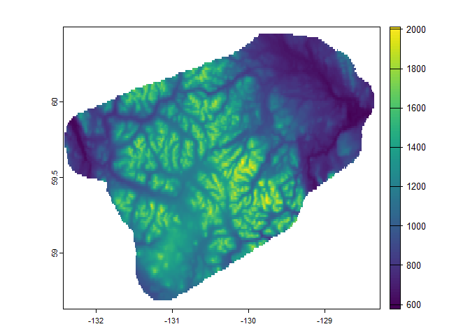
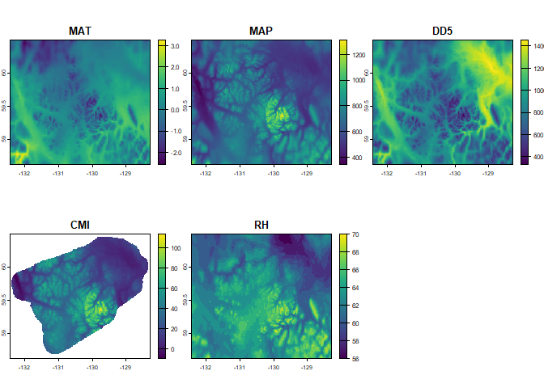
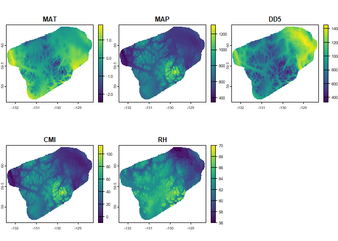

# ClimateBC and ClimateNA

2024-11-08

Websites:

- https://climatebc.ca/
- https://climatena.ca/

The new ClimateNAr library enables the downloading of up to 800m
resolution climate normals and projections for BC and western NA. In
this vignette, we will illustrate the use of the `ClimateNAr` package
along with the `terra` package for reading and writing rasters. The
`ClimateNAr` package needs to be downloaded and installed manually
following the instructions:

1.  Go to https://register.climatena.ca/ and register (it’s free)
2.  Download the ClimateBC/NA R package and documentation
3.  Start R, go to the Packages menu, and select “Install package(s)
    from local file”
4.  Once installed, restart R and load the library: library(ClimateNAr)

``` r
library(terra)
library(ClimateNAr)
```

In this short vignette, we will illustrate the use of the `ClimateNAr`
package to download normal and projected data for an area of interest
defined by a DEM raster. The steps include:

1.  Create a boundary raster in tif format using a 900m resolution; make
    sure that the tif is in lat/long (“EPSG:4326”).
2.  Use the climateNAr function to download the files. The function has
    4 parameters (make sure to read the package documentation for more
    details):

- inputFile: the name of the tif dem raster
- varList: the climate variables of interest
- periodList: the names of the normal and projected scenarios
- outDir: the name of the output directory (this will be created by the
  function)

### Read the DEM raster (needed for clipping)

``` r
r = rast('dem900m.tif')
plot(r)
```



### Enter parameters for climateNAr function

``` r
inputFile = 'dem900m.tif'
varList = c('MAT','MAP','DD5','CMI','RH')
periodList = c('Normal_1961_1990.nrm','Year_1902.ann','8GCMs_ensemble_ssp245_2041-2070.gcm')
outDir = 'download/'
if (!dir.exists(outDir)) dir.create(outDir)
```

### Download the climate data and plot

``` r
test <- climateNAr(inputFile, periodList, varList, outDir)
print(test)
```

    class       : SpatRaster 
    dimensions  : 146, 324, 5  (nrow, ncol, nlyr)
    resolution  : 0.01283385, 0.01283385  (x, y)
    extent      : -132.4369, -128.2788, 58.6258, 60.49954  (xmin, xmax, ymin, ymax)
    coord. ref. :  
    source(s)   : memory
    names       :   MAT,  MAP,  DD5,    CMI, RH 
    min values  : -2.57,  345,  331,  -9.49, 56 
    max values  :  3.28, 1313, 1455, 114.02, 70 

``` r
plot(test)
```



### Clip the climate data to the DEM boundary

``` r
crs(test) <- "EPSG:4326" # set CRS to match DEM
test_mask <- mask(test, r) 
```

### Plot the downloaded raster

``` r
plot(test_mask)
```


