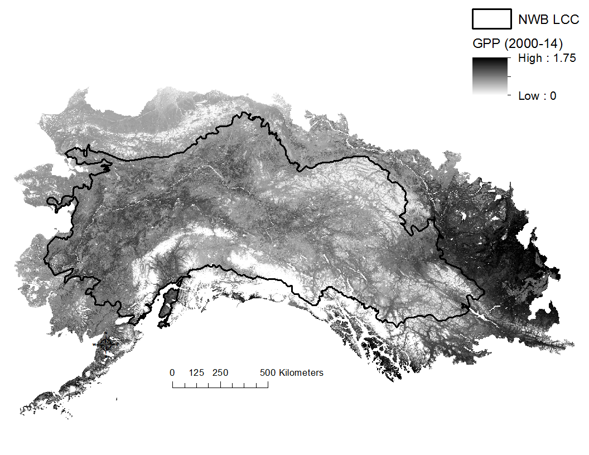

# Gross Primary Productivity

Canadian BEACONs Project, University of Alberta

September 9, 2015

## Description

Gross primary productivity (GPP) is a measure of ecosystem functioning. It represents the cumulative effect of ecological processes such as soil formation, nutrient cycling, photosynthesis, and population dynamics. Productivity may be related to patterns in species diversity (Currie 1991, Hector et al. 1999). For example, the most common hypothesis is that species diversity is greatest at moderate levels of primary productivity (Loreau et al. 2001). GPP quantifies the amount of carbon absorbed by living plants during photosynthesis. GPP units are in kilograms of carbon per square metre per year (kg C/m^2^/yr). The GPP dataset was developed from MODIS GPP/NPP (MOD17) 1-km^2^ resolution satellite imagery (Zhao et al. 2005, 2006, Zhao and Running 2010; Figure B2). MODIS GPP has an 8-day temporal resolution and is ideal for monitoring spatial patterns in photosynthetic activity (Heinsch et al. 2003). The current GPP data represents the mean of 14 years of data, measured from 2000 to 2014.

## Data Sources

GPP and NPP data are available in GeoTIFF format for 2000-14 from the University of Montana (<http://www.ntsg.umt.edu/project/mod17>). The dataset(s) for the individual years and for the mean of 2000-14 (MOD17A3\_Science\_GPP\_mean\_00\_14.tif) can be downloaded from:

- <ftp://ftp.ntsg.umt.edu/pub/MODIS/Mirror/MOD17/GeoTIFF/MOD17A3/GeoTIFF_30arcsec/>

General characteristics:

- Temporal resolution: Annual (total of annual period)
- Spatial resolution: 30-arcsec (0.00833 deg)
- Data format: GeoTIFF
- Projection: WGS84 Geographic
- Temporal extent: 2000 - 2014
- Spatial extent: Global
- Units: 0.1 x g carbon m-2

## Data Processing

**ArcGIS -- Creating a regional GPP raster**

The following steps will extract a subset of the world GPP raster, ensure it is in the appropriate regional projection and scale, convert very large values (65535) to Null values, and convert the units to Kg-C/m2/yr (values should range between 0-10). Box 1 provides corresponding sample Python code to automate the procedure.

1. Start a new ArcGIS project and add a raster boundary map for the study region. The raster should have the desired properties e.g., spatial extent, resolution, coordinate system.
2. Set the Environment Settings (i.e., Output Coordinate, Processing Extent, and Raster Analysis) to match those of the study region raster.
3. Use the "Extract by Mask" function to extract the required area from the GPP tiff file. Accept the default "Output raster".
4. Use the "Set Null" function to set all values of the output raster to be equal to 65535 to NULL (click SQL button and set "value => 65535"). The "Input false raster or constant value" should be the same as the "Input conditional raster". Accept the default "Ouput raster".
5. Use the \"Raster Calculator\" to Divide by 10000.0 (i.e., not 10000). This will convert from the original 0.1 x gC/m2/year to KgC/m2/year.
6.  Resample to 250-m resolution.

```python
**Box 1. Sample Python code to create regional GPP raster.**

import arcpy
from arcpy import env
from arcpy.sa import *
arcpy.CheckOutExtension("Spatial")
bnd = "bnd.tif"
gpp = "MOD17A3_Science_GPP_mean_00_14.tif"
out = "gpp_0014.tif"
env.overwriteOutput = True
env.workspace = env.scratchFolder
bndPrj = arcpy.Describe(bnd).spatialReference
arcpy.env.outputCoordinateSystem = bndPrj
env.extent = bnd
env.snapRaster = bnd
env.cellSize = bnd
tmp1 = ExtractByMask(gpp, bnd)
tmp2 = SetNull(tmp1, tmp1, "VALUE = 65535")
tmp3 = tmp2 / 10000.0
tmp3.save(out)
```

## NWB LCC Datasets

The master LED datasets (1-km^2^ and resampled 250-m versions) are located on the BEACONs Dropbox and cover the entire NWB LCC plus surrounding areas to allow for analyses that extend beyond the study region i.e., in some cases benchmark construction may extend beyond an ecoregion to satisfy hydrology and size requirements. Subsets of this dataset were extracted to the NWB LCC boundary and to each ecoregion and ecoregion + HUC or ecoregion + FDA.

250m dataset:

-   Dropbox (BEACONs)/NWB LCC/gisdata/criteria/nwb\_lcc\_plus/250m/gpp\_0014.tif (newest version 2000-2014)
-   Dropbox (BEACONs)/NWB LCC/gisdata/criteria/nwb\_lcc\_plus/250m/gpp\_0013.tif (previous version 2000-2013)

1000m dataset:

- Dropbox (BEACONs)/NWB LCC/gisdata/criteria/nwb\_lcc\_plus/1000m/gpp\_0014.tif (newest version 2000-2014)
- Dropbox (BEACONs)/NWB LCC/gisdata/criteria/nwb\_lcc\_plus/1000m/gpp\_0013.tif (previous version 2000-2013)

{width="6.489583333333333in" height="5.010416666666667in"}

Figure 1. Distribution of 250-m resolution GPP (2000-2014 average) within the NWB LCC and surrounding regions.

## References

Currie, D. J. 1991. Energy and large-scale patterns of animal and plant species richness. American Naturalist 137:27-49.

Hector, A., B. Schmid, C. Beierkuhnlein, et al. 1999. Plant diversity and productivity experiments in European grasslands. Science 286:1123-1127.

Heinsch F.A., M. Reeves, P. Votava, et al. 2003. User's Guide. GPP and NPP (MOD17A2/A3) Products. NASA MODIS Land Algorithm. URL: http://ntsg.umt.edu/sites/ntsg.umt.edu/files/modis/MOD17UsersGuide.pdf

Loreau, M., S. Naeem, P. Inchausti, J. Bengtsson, J.P. Grime, A. Hector, D.U. Hooper, M.A. Huston, D. Raffaelli, B. Schmid, D. Tilman, and D.A. Wardle. 2001. Biodiversity and ecosystem functioning: current knowledge and future challenges. Science 294:804-808.

Zhao, M., F. A. Heinsch, R. R. Nemani, and S. W. Running. 2005. Improvements of the MODIS terrestrial gross and net primary production global data set. Remote Sensing of Environment 95: 164.176.

Zhao, M., S. W. Running, and R. R. Nemani. (2006). Sensitivity of Moderate Resolution Imaging Spectroradiometer (MODIS) terrestrial primary production to the accuracy of meteorological reanalyses. Journal of Geophysical Research, 111, G01002.

Zhao, M. and S. W. Running. 2010. Drought-induced reduction in global terrestrial net primary production from 2000 through 2009. Science, 329:940-943.
